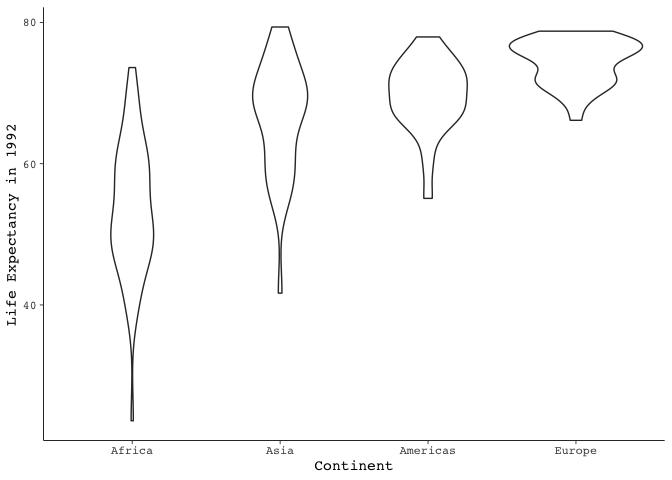
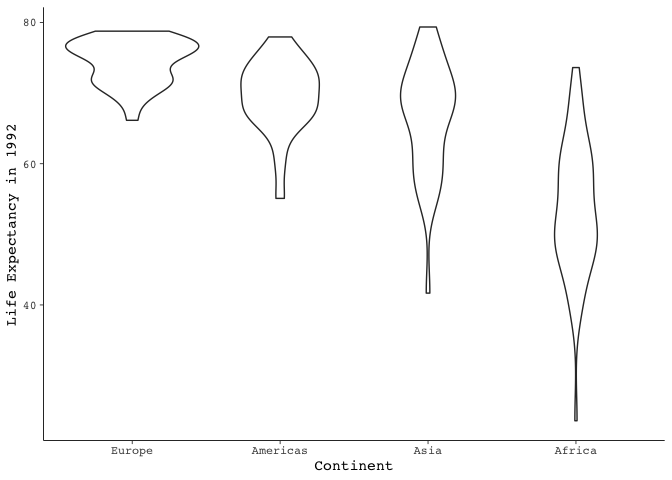
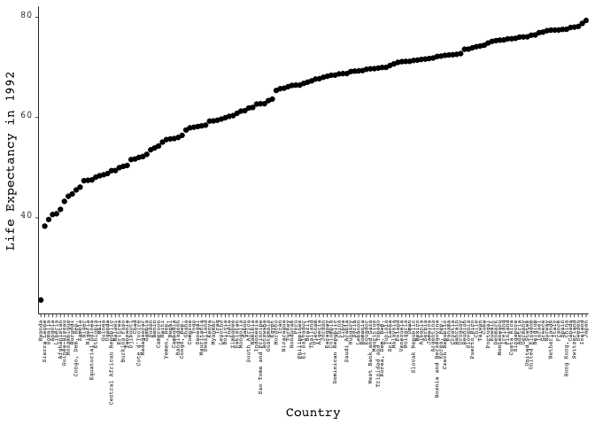
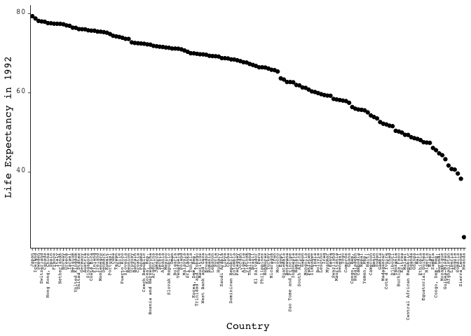
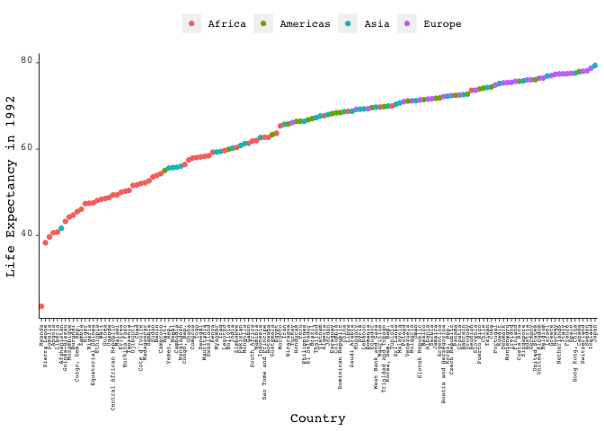

Homework5
================

First load the packages

``` r
library(gapminder)
library(tidyverse)
```

    ## ── Attaching packages ───────────────────────────────────────── tidyverse 1.2.1 ──

    ## ✔ ggplot2 3.0.0     ✔ purrr   0.2.5
    ## ✔ tibble  1.4.2     ✔ dplyr   0.7.6
    ## ✔ tidyr   0.8.1     ✔ stringr 1.3.1
    ## ✔ readr   1.1.1     ✔ forcats 0.3.0

    ## ── Conflicts ──────────────────────────────────────────── tidyverse_conflicts() ──
    ## ✖ dplyr::filter() masks stats::filter()
    ## ✖ dplyr::lag()    masks stats::lag()

``` r
library(forcats)
library(plotly)
```

    ## 
    ## Attaching package: 'plotly'

    ## The following object is masked from 'package:ggplot2':
    ## 
    ##     last_plot

    ## The following object is masked from 'package:stats':
    ## 
    ##     filter

    ## The following object is masked from 'package:graphics':
    ## 
    ##     layout

Factor Management and Faceting
==============================

First lets explore how to partially (and later completely) remove Oceania from the *Gapminder* dataset. The `summary` function breaks down the `continent` variable to show the frequency at which each data point occurs per continent.

``` r
summary(gapminder$continent)
```

    ##   Africa Americas     Asia   Europe  Oceania 
    ##      624      300      396      360       24

There are five continents, and 24 entries belong to Oceania. Removing one continent leaves us with four, so `four_cont` can be our variable name. We can use `summary` on the `four_cont` dataset to check if the countries that belong to Oceania have been removed.

``` r
four_cont <- gapminder %>%
  filter(continent != "Oceania")
summary(four_cont$continent)
```

    ##   Africa Americas     Asia   Europe  Oceania 
    ##      624      300      396      360        0

However, completely removing trace that Oceania existed requires the `droplevels` function. To keep thing organized, this would require a new variable name that builds upon the last one used, like `no_oceania`.

``` r
no_oceania <- droplevels(four_cont)
summary(no_oceania$continent)
```

    ##   Africa Americas     Asia   Europe 
    ##      624      300      396      360

Now lets look at the median and lowest lifeExp of countries within the Americas continent, sorted ascendingly by lowest lifeExp.

``` r
americaslifeExp <- gapminder %>%
  filter(continent == "Americas") %>%
  group_by(country) %>%
  summarize(
    Continent = unique(continent),
    MinLifeExp = min(lifeExp),
    MedianLifeExp = median(lifeExp)
  ) %>%
  arrange(MinLifeExp)
knitr::kable(americaslifeExp)
```

| country             | Continent |  MinLifeExp|  MedianLifeExp|
|:--------------------|:----------|-----------:|--------------:|
| Haiti               | Americas  |      37.579|        50.6920|
| Bolivia             | Americas  |      40.414|        51.9410|
| Honduras            | Americas  |      41.912|        59.1555|
| Guatemala           | Americas  |      42.023|        57.0830|
| Nicaragua           | Americas  |      42.314|        58.3840|
| Peru                | Americas  |      43.902|        59.9265|
| El Salvador         | Americas  |      45.262|        57.4515|
| Dominican Republic  | Americas  |      45.928|        62.7575|
| Ecuador             | Americas  |      48.357|        62.8260|
| Colombia            | Americas  |      50.643|        65.2450|
| Mexico              | Americas  |      50.789|        66.2185|
| Brazil              | Americas  |      50.917|        62.4125|
| Chile               | Americas  |      54.745|        68.8085|
| Venezuela           | Americas  |      55.088|        68.0065|
| Panama              | Americas  |      55.191|        69.5765|
| Costa Rica          | Americas  |      57.206|        72.1000|
| Jamaica             | Americas  |      58.530|        70.6600|
| Trinidad and Tobago | Americas  |      59.100|        68.5660|
| Cuba                | Americas  |      59.421|        73.1830|
| Argentina           | Americas  |      62.485|        69.2115|
| Paraguay            | Americas  |      62.649|        66.6135|
| Puerto Rico         | Americas  |      64.280|        73.5950|
| Uruguay             | Americas  |      66.071|        70.1430|
| United States       | Americas  |      68.440|        74.0150|
| Canada              | Americas  |      68.750|        74.9850|

We can reorder for the dataset to show descending MinLifeExp.

``` r
americaslifeExp %>%
  arrange(desc(MinLifeExp)) %>%
  knitr::kable()
```

| country             | Continent |  MinLifeExp|  MedianLifeExp|
|:--------------------|:----------|-----------:|--------------:|
| Canada              | Americas  |      68.750|        74.9850|
| United States       | Americas  |      68.440|        74.0150|
| Uruguay             | Americas  |      66.071|        70.1430|
| Puerto Rico         | Americas  |      64.280|        73.5950|
| Paraguay            | Americas  |      62.649|        66.6135|
| Argentina           | Americas  |      62.485|        69.2115|
| Cuba                | Americas  |      59.421|        73.1830|
| Trinidad and Tobago | Americas  |      59.100|        68.5660|
| Jamaica             | Americas  |      58.530|        70.6600|
| Costa Rica          | Americas  |      57.206|        72.1000|
| Panama              | Americas  |      55.191|        69.5765|
| Venezuela           | Americas  |      55.088|        68.0065|
| Chile               | Americas  |      54.745|        68.8085|
| Brazil              | Americas  |      50.917|        62.4125|
| Mexico              | Americas  |      50.789|        66.2185|
| Colombia            | Americas  |      50.643|        65.2450|
| Ecuador             | Americas  |      48.357|        62.8260|
| Dominican Republic  | Americas  |      45.928|        62.7575|
| El Salvador         | Americas  |      45.262|        57.4515|
| Peru                | Americas  |      43.902|        59.9265|
| Nicaragua           | Americas  |      42.314|        58.3840|
| Guatemala           | Americas  |      42.023|        57.0830|
| Honduras            | Americas  |      41.912|        59.1555|
| Bolivia             | Americas  |      40.414|        51.9410|
| Haiti               | Americas  |      37.579|        50.6920|

Now lets take the `no_oceania` dataset and plot it for 1992 with faceting for lifeExp.

``` r
no_oceania %>%
  filter(year == 1992) %>%
  mutate(continent = fct_reorder(continent, lifeExp)) %>%
  ggplot(aes(continent, lifeExp)) +
  geom_violin(aes()) +
  theme(
    plot.subtitle = element_text(vjust = 1),
    plot.caption = element_text(vjust = 1),
    axis.line = element_line(
      size = 0.3,
      linetype = "solid"
    ),
    axis.ticks = element_line(size = 0.3),
    axis.title = element_text(family = "mono"),
    axis.text = element_text(family = "mono"),
    axis.text.x = element_text(family = "mono"),
    axis.text.y = element_text(family = "mono"),
    panel.background = element_rect(fill = NA)
  ) +
  labs(x = "Continent", y = "Life Expectancy in 1992")
```



The faceting can be modified to tell different stories, here continents are sorted descendingly by median, which is where the "broadest" region of the violin plot exists. This can

``` r
no_oceania %>%
  filter(year == 1992) %>%
  mutate(continent = fct_reorder(continent, lifeExp, median, .desc = TRUE)) %>%
  ggplot(aes(continent, lifeExp)) +
  geom_violin(aes()) +
  theme(
    plot.subtitle = element_text(vjust = 1),
    plot.caption = element_text(vjust = 1),
    axis.line = element_line(
      size = 0.3,
      linetype = "solid"
    ),
    axis.ticks = element_line(size = 0.3),
    axis.title = element_text(family = "mono"),
    axis.text = element_text(family = "mono"),
    axis.text.x = element_text(family = "mono"),
    axis.text.y = element_text(family = "mono"),
    panel.background = element_rect(fill = NA)
  ) +
  labs(x = "Continent", y = "Life Expectancy in 1992")
```



The same can be done for the lifeExp of each country (not including Oceania)

``` r
no_oceania %>%
  filter(year == 1992) %>%
  mutate(country = fct_reorder(country, lifeExp)) %>%
  ggplot(aes(country, lifeExp)) +
  geom_point(aes()) +
  theme(
    plot.subtitle = element_text(vjust = 1),
    plot.caption = element_text(vjust = 1),
    axis.line = element_line(
      size = 0.3,
      linetype = "solid"
    ),
    axis.ticks = element_line(size = 0.3),
    axis.title = element_text(family = "mono"),
    axis.text = element_text(family = "mono"),
    axis.text.x = element_text(family = "mono"),
    axis.text.y = element_text(family = "mono"),
    panel.background = element_rect(fill = NA)
  ) +
  labs(x = "Country", y = "Life Expectancy in 1992") +
  theme(axis.text = element_text(
    hjust = 1,
    vjust = 0
  ), axis.text.x = element_text(
    colour = "black",
    vjust = 0.4, angle = 90
  )) + theme(axis.text.x = element_text(size = 5)) +
  theme(plot.background = element_rect(size = 1))
```



Then faceted to be sorted descendingly according to lifeExp.

``` r
no_oceania %>%
  filter(year == 1992) %>%
  mutate(country = fct_reorder(country, lifeExp, .desc = TRUE)) %>%
  ggplot(aes(country, lifeExp)) +
  geom_point(aes()) +
  theme(
    plot.subtitle = element_text(vjust = 1),
    plot.caption = element_text(vjust = 1),
    axis.line = element_line(
      size = 0.3,
      linetype = "solid"
    ),
    axis.ticks = element_line(size = 0.3),
    axis.title = element_text(family = "mono"),
    axis.text = element_text(family = "mono"),
    axis.text.x = element_text(family = "mono"),
    axis.text.y = element_text(family = "mono"),
    panel.background = element_rect(fill = NA)
  ) +
  labs(x = "Country", y = "Life Expectancy in 1992") +
  theme(axis.text = element_text(
    hjust = 1,
    vjust = 0
  ), axis.text.x = element_text(
    colour = "black",
    vjust = 0.4, angle = 90
  )) + theme(axis.text.x = element_text(size = 5)) +
  theme(plot.background = element_rect(size = 1))
```



Reading and Writing CSV files
=============================

The `no_oceania` dataset can be exported, saving the output of transformations done with R.

``` r
write_csv(no_oceania, "GapminderWithoutOceania.csv")
```

This file can be read from the working directory

``` r
read_csv("GapminderWithoutOceania.csv")
```

    ## Parsed with column specification:
    ## cols(
    ##   country = col_character(),
    ##   continent = col_character(),
    ##   year = col_integer(),
    ##   lifeExp = col_double(),
    ##   pop = col_integer(),
    ##   gdpPercap = col_double()
    ## )

    ## # A tibble: 1,680 x 6
    ##    country     continent  year lifeExp      pop gdpPercap
    ##    <chr>       <chr>     <int>   <dbl>    <int>     <dbl>
    ##  1 Afghanistan Asia       1952    28.8  8425333      779.
    ##  2 Afghanistan Asia       1957    30.3  9240934      821.
    ##  3 Afghanistan Asia       1962    32.0 10267083      853.
    ##  4 Afghanistan Asia       1967    34.0 11537966      836.
    ##  5 Afghanistan Asia       1972    36.1 13079460      740.
    ##  6 Afghanistan Asia       1977    38.4 14880372      786.
    ##  7 Afghanistan Asia       1982    39.9 12881816      978.
    ##  8 Afghanistan Asia       1987    40.8 13867957      852.
    ##  9 Afghanistan Asia       1992    41.7 16317921      649.
    ## 10 Afghanistan Asia       1997    41.8 22227415      635.
    ## # ... with 1,670 more rows

Remaking a plot
===============

Here a plot shown before is slightly modified to show a color dimension for continent. The plot elements, like the color legend, is edited for optimal use of space.

``` r
no_oceania %>%
  filter(year == 1992) %>%
  mutate(country = fct_reorder(country, lifeExp)) %>%
  ggplot(aes(country, lifeExp)) +
  geom_point(aes(color = continent)) +
  theme(
    plot.subtitle = element_text(vjust = 1),
    plot.caption = element_text(vjust = 1),
    axis.line = element_line(
      size = 0.3,
      linetype = "solid"
    ),
    axis.ticks = element_line(size = 0.3),
    axis.title = element_text(family = "mono"),
    axis.text = element_text(family = "mono"),
    axis.text.x = element_text(family = "mono"),
    axis.text.y = element_text(family = "mono"),
    panel.background = element_rect(fill = NA)
  ) +
  labs(x = "Country", y = "Life Expectancy in 1992") +
  theme(axis.text = element_text(
    hjust = 1,
    vjust = 0
  ), axis.text.x = element_text(
    colour = "black",
    vjust = 0.4, angle = 90
  )) + theme(axis.text.x = element_text(size = 5)) +
  theme(plot.background = element_rect(size = 1)) + theme(
    legend.text = element_text(family = "mono"),
    legend.title = element_text(family = "mono"),
    legend.position = "top", legend.direction = "horizontal"
  ) + labs(colour = NULL)
```



To make this graph interactive in an HTML setting, the `plotly` library can enable interactive properties. However, much of the custom edits available in the `ggplot2` package are ignored by `plotly`. The HTML output is commented out (suppressed) because it interferes with .md kitting into github\_document format.

``` r
plotly_plot <- no_oceania %>%
  filter(year == 1992) %>%
  mutate(country = fct_reorder(country, lifeExp)) %>%
  ggplot(aes(country, lifeExp)) +
  geom_point(aes(color = continent)) +
  theme(
    plot.subtitle = element_text(vjust = 1),
    plot.caption = element_text(vjust = 1),
    axis.line = element_line(
      size = 0.3,
      linetype = "solid"
    ),
    axis.ticks = element_line(size = 0.3),
    axis.title = element_text(family = "mono"),
    axis.text = element_text(family = "mono"),
    axis.text.x = element_text(family = "mono"),
    axis.text.y = element_text(family = "mono"),
    panel.background = element_rect(fill = NA)
  ) +
  labs(x = "Country", y = "Life Expectancy in 1992") +
  theme(axis.text = element_text(
    hjust = 1,
    vjust = 0
  ), axis.text.x = element_text(
    colour = "black",
    vjust = 0.4, angle = 90
  )) + theme(axis.text.x = element_text(size = 5)) +
  theme(plot.background = element_rect(size = 1)) + theme(
    legend.text = element_text(family = "mono"),
    legend.title = element_text(family = "mono"),
    legend.position = "top", legend.direction = "horizontal"
  ) + labs(colour = NULL)

# ggplotly(plotly_plot)
```

Saving images
=============

Here the plot shown above is exported as a high-resolution .png image.

``` r
ggsave("NoOceania.png",
  plot = plotly_plot, 
  device = "png",
  width = 12, 
  height = 6,
  dpi = 500)
```

Then it can be called back.
